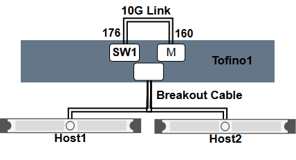

# DPTP
Data-Plane Time synchronization Protocol

Paper Link :point_right:	 https://www.comp.nus.edu.sg/~pravein/papers/DPTP_SOSR19.pdf

This source code synchronizes two Barefoot Tofino switches to support the global timing (64-bit) in the data-plane. 
Once DPTP is running, packets can have a global timing context, which is useful for several applications like latency tracking, monitoring, updates, ordering of events, etc.

p4_14 : [v_14/](https://github.com/praveingk/DPTP/tree/master/v_14) (Tested on SDE 8.x.x)

p4_16 : [v_16/](https://github.com/praveingk/DPTP/tree/master/v_16) (Tested on SDE 9.x.x)


# Topology 
The Topology used in as below : 




A single tofino switch named "tofino1" is virtualized into two switches Master(M) and Switch1. To do this virtualization, you will need to add a loopback link between port3 (160-163) and port5 (176-179). Once done, it will be configured as 10G ports, and we will be using only one link (160-176) as the connection between Switch1 and Master. Additionally, you will need atleast one host connected to port 1(128-131) to send DPTP requests.
### Steps to run p4_14 based DPTP in Tofino:

1) Navigate to the SDE PATH :
```shell
     cd ~/bf-sde-8.x.x
     export DPTP_PATH=<PATH TO DPTP FOLDER>
```
2) Set the env variables : 
```shell
     . ./set_sde.bash
```
3) Build the p4 program using the command :
```shell
     ./p4_build.sh $DPTP_PATH/v_14/dptp_topo.p4
```
4) Load the p4 program, and run the control plane API code using :
```shell
     cd $DPTP_PATH/v_14/CP
     ./run.sh
```
5) This should automatically start the synchronization between Switch1 and master through packets from control-plane.


### Steps to run p4_16 based DPTP in Tofino:

1) Navigate to the SDE PATH :
```shell
     cd ~/bf-sde-9.x.x
     export DPTP_PATH=<PATH TO DPTP FOLDER>
```
2) Set the env variables : 
```shell
     . ./set_sde.bash
```
3) DPTP program in p4_16 has multiple profiles :

     a) DPTP with logical switches to get measurements and to do a sanity check.
     ```shell
          ./p4_build.sh -DLOGICAL_SWITCHES $DPTP_PATH/v_16/p4_src/dptp.p4
     ```
     
     b) DPTP without logical switches. This is basically the program that can be included in any p4 programs
     ```shell
          ./p4_build.sh $DPTP_PATH/v_16/p4_src/dptp.p4
     ``` 
     
4) Load the p4 program, and run the control plane API code using :
```shell
     cd $DPTP_PATH/v_16/CP
     ./run.sh
```
   If you want to enable debugs the command is :

```shell
     ./run.sh debug
```

5) This should automatically start the synchronization between Switch1 and master through packets from control-plane.


### Steps to run MoonGen for host synchronization:
Moongen script sends synchronization requests packets between switches
Pull from https://github.com/praveingk/moongen/, Make sure the submodule libmoon is also pulled. 
Follow the readme instructions in moongen to build it.
1) Enable the NIC to work with DPDK:
```shell
sudo ./libmoon/deps/dpdk/usertools/dpdk-devbind.py --b igb_uio <NIC Ports>
```

2) To start DPTP in the network between switch 1 and master:
```shell
 sudo ./build/MoonGen examples/dptp_host.lua <DPDK PORT id1> <DPDK Port id2>
```
Note that "DPDK Port id2" is redundant and is used only for switch-to-host DPTP accuracy measurement. 

### Steps to Create CrossTraffic in the Link(160-176) during DPTP

1) To create cross-traffic in the link being used for synchronization towards the SW1 (i.e. 160 --> 176),
we simply craft a packet to destination address of SW1 (0x100000000001) and send it from any host link.
```shell
 sudo ./build/MoonGen examples/dptp_host.lua -d 1 <DPDK PORT id1> <DPDK Port id2>
```
Note that "DPDK Port id2" is redundant and is used only for switch-to-host DPTP accuracy measurement. 

2) To create oversubscribed traffic, run the above example from two 10G host-links.
